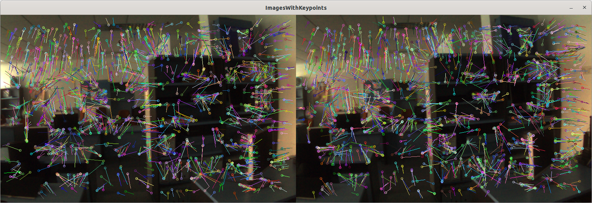
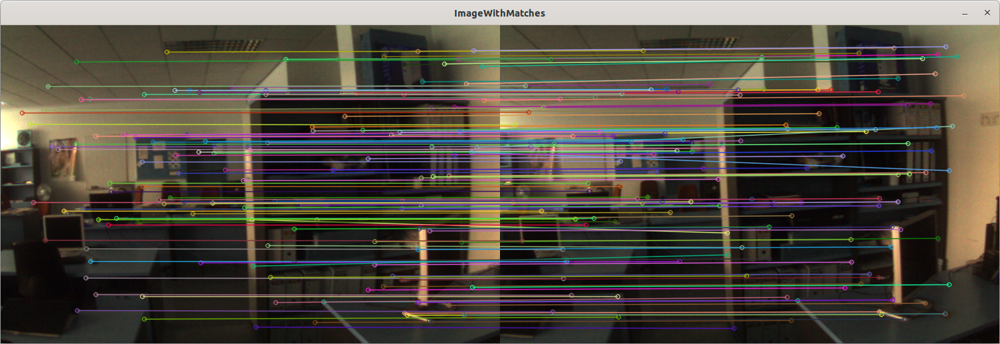
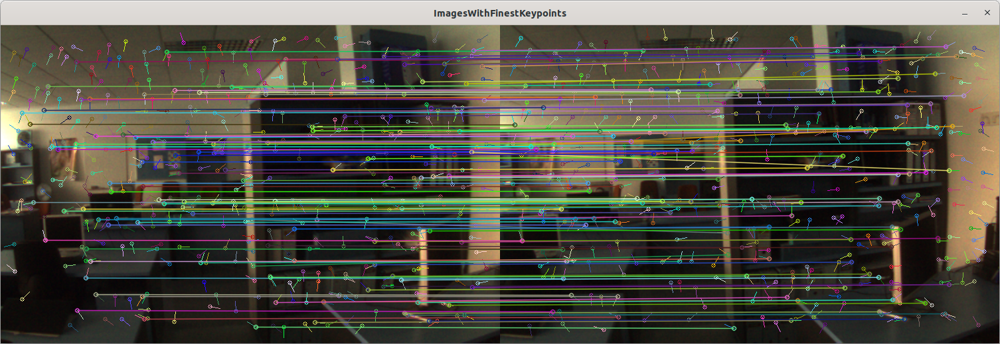
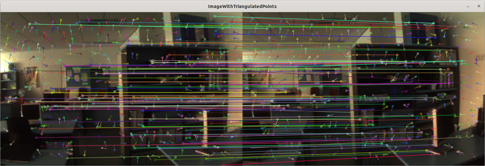

# ORB_SLAM_Tracking

1. 将跟踪线程从ORB_SLAM中剥离，提供最小可运行的SLAM系统
2. 提供详细的中文注释
3. 每个模块：特征提取、特征匹配、初始化等均提供可单独运行demo

## 详细教程及说明

* ⭐ [Zeal's Blog](https://zeal-up.github.io/categories/)
* 🛠 [Zeal's 知乎专栏](https://www.zhihu.com/people/kai-shi-dong-liao-ge)
* 🌀 [Zeal's Github](https://github.com/zeal-up?tab=repositories)

## demo

### demo -- initialization

代码克隆——有子仓库

```bash
git clone --recursive url
```

主文件

`./demo/demo_initialization.cpp`

编译

```bash
mkdir build && cd build
cmake ..
```

初始化的图片放置在`./demo/initImages/`下。在`cmake`阶段会将图片拷贝到`build`目录下

运行

```bash
cd build
./demo_initialization ./Settings.yaml ./initImages 1
```

运行结果

特征提取


特征匹配


特征匹配-金字塔第一层特征


三角化的点
